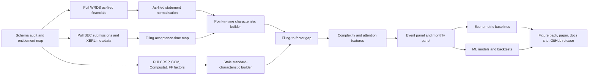
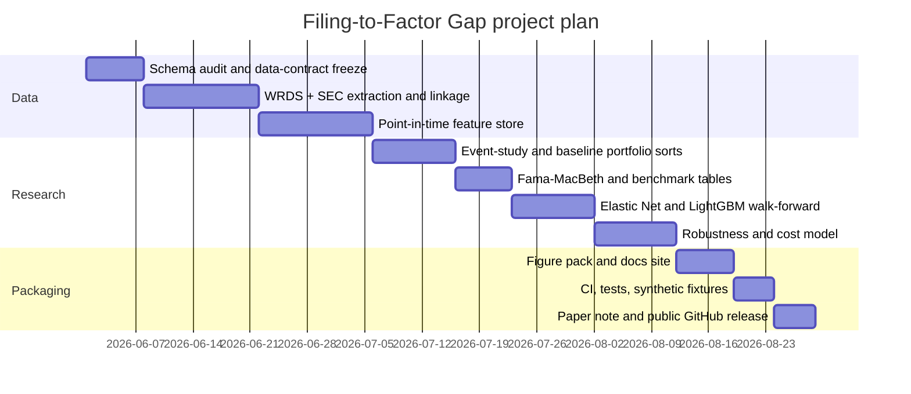

# Filing-to-Factor Gap

## Executive summary

The strongest single project for your constraints is a **point-in-time equity asset-pricing study built from as-filed financial statements**. I would title it **Filing-to-Factor Gap: Asset Pricing with As-Filed Fundamentals and Reporting Complexity**. The core idea is to reconstruct firm characteristics directly from **as-filed 10-Q and 10-K financial statements at the moment they become public**, compare those signals with the **latest stale standardised characteristics** available to the market, and test whether the resulting **filing-to-factor gap** and **reporting-complexity frictions** predict subsequent stock returns. This is academically serious because it is a clean asset-pricing question about information-processing costs and delayed incorporation of public information, and it is highly legible to a hiring quant because it combines difficult data engineering, careful timing, panel econometrics, modern ML, realistic backtesting, and a polished research repository. The SEC’s EDGAR APIs explicitly provide real-time submissions history and XBRL financial-statement data, including company facts and standard-taxonomy concepts, while the French Data Library remains the canonical benchmark for factor adjustment and now documents the post-2024 CRSP CIZ transition. citeturn5view2turn6view0turn6view2

This direction is intentionally **orthogonal** to the themes already covered in the attached notes: option surfaces, insider information, geographic segments, Item 1A risk text, corporate-bond relative value, credit-to-equity spillovers, production networks, and 13F ownership networks. fileciteturn0file2 fileciteturn0file1 fileciteturn0file3 fileciteturn0file4 fileciteturn0file5 fileciteturn0file6 fileciteturn0file8 fileciteturn0file9

The economic thesis is simple and powerful. Public information is not all equally easy to process. When a filing’s **as-filed fundamentals** imply a large change in profitability, investment, balance-sheet quality, or accrual intensity, but that change is difficult to map into the familiar standardised factors investors actually trade on, prices may adjust only gradually. A recent paper on disclosure complexity argues that higher cognitive complexity slows price discovery and increases mispricing duration, while deep asset-pricing work shows that nonlinear, characteristic-based models can materially improve explained variation and pricing errors when the signal is high-dimensional and state dependent. citeturn25academia0turn20academia0turn31academia0

The best public-facing GitHub version should therefore have one sharp research question: **do point-in-time as-filed characteristic innovations and reporting-complexity frictions price the cross-section of subsequent equity returns beyond standard lagged Compustat characteristics and Fama–French benchmarks?** The answerable deliverable is a full research stack: schema audit, point-in-time feature builder, event-study engine, econometric baselines, LightGBM production model, optional deep asset-pricing extension, cost-aware backtests, publication-quality figures, GitHub Pages documentation, CI, tests, and a paper-style report. citeturn5view2turn14view0turn17search0turn17search2turn15view2turn15view3

| Element | Recommended choice |
|---|---|
| Project title | **Filing-to-Factor Gap: Asset Pricing with As-Filed Fundamentals and Reporting Complexity** |
| Core market | U.S. equities |
| Primary novelty | Point-in-time reconstruction of characteristics from as-filed statements |
| Main outcome | Next-month excess returns and post-filing drift |
| Core WRDS stack | `contrib_as_filed_financials`, `comp_na_daily_all`, `crsp_a_stock`, `crsp_a_ccm`, `ff_all`, optional `tr_ibes`, optional TAQ-liquidity products |
| External official source | SEC EDGAR submissions and XBRL APIs |
| Econometric core | Event studies, Fama–MacBeth, portfolio sorts |
| ML core | Elastic Net and LightGBM |
| Stretch model | Conditional deep asset-pricing model on filing-derived features |
| Default sample | Open-ended; sensible default is 2010–2025, with 2026 YTD held out |

## Project thesis and research design

The project should begin with a one-sentence thesis in the README:

> **Public accounting information is not immediately transformed into priced characteristics; the harder the filing is to translate into familiar factor language, the slower the market incorporates it.**

That thesis is well aligned with the SEC data-generating process. The SEC states that the EDGAR APIs expose **submissions history by filer** and **XBRL data from financial statements**, that the JSON structures are updated throughout the day in real time, that the submissions API is updated with a typical delay of less than a second, and that the XBRL APIs aggregate standard-taxonomy facts across filings. The same SEC page also notes that XBRL was first required in 2009 and that firms may extend standard taxonomies with custom taxonomies. Those facts make a 2009 warm-up and a 2010 default sample start especially sensible. citeturn5view2

The research question should be:

**Do as-filed characteristic shocks and filing-complexity frictions predict future stock returns, after controlling for standard lagged characteristics and benchmark factors?** citeturn25academia0turn6view0

The most useful hypotheses are these.

| Hypothesis | Statement | Main test |
|---|---|---|
| Hidden-fundamental hypothesis | As-filed profitability, investment, and accrual innovations predict future returns more strongly than stale standardised characteristics available before the filing | Event studies and monthly cross-sectional regressions |
| Filing-to-factor-gap hypothesis | The gap between as-filed characteristics and the most recent pre-filing standard factor inputs predicts returns in the direction of the as-filed signal | Double sorts and Fama–MacBeth |
| Complexity-friction hypothesis | The return predictability of as-filed signals is stronger when filings are harder to process | Interaction tests with filing-complexity scores |
| Attention-timing hypothesis | Underreaction is larger for after-close and lower-attention filings | Acceptance-time heterogeneity and open-to-open returns |
| Nonlinearity hypothesis | Tree-based and deep characteristic models outperform sparse linear models because the mapping from filing signals to expected returns is nonlinear and state dependent | Walk-forward OOS horse race |

A clean conceptual decomposition is:

\[
\text{Gap}_{i,t} = z\!\left(\text{AsFiledChar}_{i,t}^{\text{public}} - \text{StaleChar}_{i,t^-}^{\text{market}}\right)
\]

\[
\text{AlphaSignal}_{i,t} = f\!\left(\text{Gap}_{i,t}, \text{Complexity}_{i,t}, \text{Attention}_{i,t}, X_{i,t}\right)
\]

where \(\text{AsFiledChar}_{i,t}^{\text{public}}\) is built only from the newly public filing, \(\text{StaleChar}_{i,t^-}^{\text{market}}\) is the latest standardised characteristic set available before the filing, and \(X_{i,t}\) contains conventional controls such as size, momentum, liquidity, and analyst coverage. The economic interpretation is that **the gap is not “misreporting”**; it is the wedge between raw public information and the factor representation that market participants are most used to trading. That is exactly the sort of wedge a quant employer will understand immediately. citeturn25academia0turn20academia0turn31academia0

## Data architecture and feature design

This project is designed around WRDS products that appear in your uploaded **accessible-yes** inventory, especially `contrib_as_filed_financials`, `comp_na_daily_all`, `crsp_a_stock`, `crsp_a_ccm`, `ff_all`, and optionally `tr_ibes`, `contrib_liquidity_taq`, and the WRDS TAQ/CRSP link products. Because the exact schemas of contributed products and some WRDS interfaces vary by account and delivery mode, the first code artefact should be a **deterministic schema audit** that freezes a `schema_map.yml` before a single modelling script is written. That is not a nicety; it is a reproducibility requirement. 

The **required** source stack should be as follows.

| Layer | Source | Role in project | Minimum objects |
|---|---|---|---|
| As-filed fundamentals | WRDS `contrib_as_filed_financials` | Point-in-time raw accounting facts | filing-level or fact-level financial statements |
| Filing metadata | SEC EDGAR submissions API | Filing acceptance time, accession, form type, amendments | submissions history JSON |
| Standardised fundamentals | WRDS Compustat / CCM | Slow-moving benchmark characteristics and identifier discipline | annual/quarterly fundamentals, link history |
| Returns and implementation | WRDS CRSP | Daily and monthly returns, prices, shares, delistings | stock return and security history tables |
| Benchmark factors | Kenneth French Data Library / `ff_all` | FF3 / FF5 / momentum / benchmark alphas | factor files and test portfolios |
| Attention controls | WRDS `tr_ibes` | Analyst coverage, dispersion, revisions | optional but useful |
| Liquidity controls | WRDS TAQ-liquidity products | Cost calibration and friction controls | optional for headline, recommended for appendix |

The SEC data are especially valuable because the SEC APIs expose **submissions history**, **company facts**, **company concepts**, and **bulk ZIP downloads** without API keys, and the XBRL APIs explicitly aggregate standard-taxonomy facts across filings. The SEC also notes that firms can extend the standard taxonomy with their own custom taxonomy, which is exactly what makes filing complexity and mapping difficulty measurable rather than rhetorical. citeturn5view2

You should treat the **sample period as open-ended**, but the best default choice is **2010–2025**, with **2009** as a warm-up year and **2026 year-to-date** held out as a final untouched demo window. That default is justified because the SEC states that XBRL was first required in 2009, while the French Data Library remains the standard benchmark for post-estimation factor adjustment and now explicitly documents the CRSP CIZ transition from January 2025 onward. citeturn5view2turn6view0

The preprocessing pipeline should be deterministic and timing-clean.



The most important engineering rule is **activation at public availability**, not fiscal-period end. For every 10-Q or 10-K, define the first tradable timestamp from the SEC acceptance time: if a filing arrives during market hours, the signal becomes tradable from the next executable bar you specify in advance; if it arrives after the close, the signal becomes tradable at the next day’s open or close depending on the backtest convention. Because the SEC says submissions are updated throughout the day in real time, accepted time is the natural point-in-time anchor. citeturn5view2

The feature design should have four blocks.

| Feature block | What to build | Why it matters |
|---|---|---|
| As-filed characteristics | profitability, gross profitability, operating margin, accruals, asset growth, investment, financing growth, cash-flow quality | Core economic content of new filings |
| Filing-to-factor gap | as-filed minus latest pre-filing standard characteristic, z-scored by month and industry | Captures newly public but not-yet-standardised information |
| Complexity and mapping | custom-tag share, non-standard line-item count, articulation failures, missingness burden, mapping entropy, amendment flag | Measures information-processing cost |
| Attention and implementation | size, turnover, analyst coverage, filing after close, bid–ask proxy, dollar volume | Tests limits-to-attention and tradability |

Your characteristic builder should map as-filed facts into a disciplined and finite set of **30–40 characteristics**, not a sprawling zoo. Start from profitability, investment, accruals, funding changes, and balance-sheet quality. Use Compustat-style lags only for the stale baseline comparator, not to construct the “new information” side. If the contributed as-filed product does not expose tag-level complexity variables cleanly, you should still proceed: fall back to standard SEC companyfacts and companyconcept endpoints for the major concepts, and compute complexity from coverage, sparsity, articulation, and amendment structure rather than only from custom-taxonomy counts. citeturn5view2

A compact characteristic map worth hard-coding into documentation is below.

| Economic domain | As-filed examples | Standard comparator |
|---|---|---|
| Profitability | gross profits/assets, operating income/book equity, CFO/assets | latest pre-filing Compustat profitability signals |
| Investment | \(\Delta\) assets/assets, capex/assets, working-capital investment | latest pre-filing investment signals |
| Quality | accruals, cash conversion, NOA growth, leverage change | latest pre-filing quality/balance-sheet signals |
| Financing | debt issuance, equity issuance, share count change | latest pre-filing issuance signals |
| Statement quality | articulation checks, extension dependence, line-item irregularity | no direct standard comparator; treated as friction |

## Estimation, identification, and portfolio construction

The modelling ladder should be **econometric first, production ML second, deep asset pricing third**. That ordering is crucial. The objective is not to impress with architecture names; it is to show that each layer adds something economically interpretable.

The **core econometric design** should have three blocks. First, event studies around filing dates, where the dependent variables are open-to-open and close-to-close abnormal returns at 1-, 5-, 20-, and 60-trading-day horizons. Second, monthly Fama–MacBeth-style regressions of next-month excess returns on filing-to-factor gaps, complexity, and standard controls. Third, long–short portfolio sorts on the gap and on gap × complexity. The factor benchmark in all asset-pricing tables should use the French library, which currently documents the CRSP CIZ-based construction of U.S. research returns and the change in monthly-return methodology after December 2024. citeturn6view0turn6view2

The **ML horse race** should be narrow and serious.

| Model | Role | Why it belongs | Keep in headline paper |
|---|---|---|---|
| Univariate and double sorts | Economic intuition | Makes the signal easy to explain | Yes |
| Fama–MacBeth | Canonical inference | Standard asset-pricing benchmark | Yes |
| Elastic Net | Sparse linear benchmark | Good for stability and feature sanity | Yes |
| LightGBM | Main production model | Strong on tabular finance data; efficient histogram learning; ranking support; GPU support if needed | Yes |
| Conditional deep asset-pricing model | Stretch research extension | Shows nonlinear state dependence in an SDF-style framework | Optional headline, strong appendix |

LightGBM is the right production workhorse here because its official documentation emphasises **histogram-based learning**, **lower memory use**, **leaf-wise tree growth**, **distributed learning**, **GPU support**, and ranking objectives such as **LambdaRank with NDCG**. Those properties are directly aligned with a large, sparse, mixed-type characteristic panel. citeturn14view0

Hyperparameter search should be done with **Optuna**, not ad hoc loops. The best reason is not fashion but discipline: Optuna’s documented strengths include **pruning** unpromising trials and **parallel execution** across processes or machines, which matters when you are repeatedly tuning on rolling windows. citeturn15view2turn15view3

The production validation design should be a strict **walk-forward** protocol. A good default is:

| Component | Recommended default |
|---|---|
| Initial training window | 2010–2017 |
| Validation window | 2018–2019 |
| Rolling OOS test | 2020–2025 |
| Untouched showcase holdout | 2026 YTD |
| Prediction horizons | 1 month for monthly panel; 5, 20, 60 trading days for filing-event panel |
| Primary model score | mean monthly Spearman rank IC |
| Secondary model scores | OOS \(R^2\), decile monotonicity, hit rate, calibration |

The **identification strategy** should be framed as an information-incorporation design, not a grand causal claim. The strongest identification add-ons are:

| Identification layer | Design | What it tests |
|---|---|---|
| Activation timing | accepted-time clean activation vs naïve fiscal-date activation | direct look-ahead audit |
| Market-close discontinuity | before-close vs after-close accepted filings | speed of price incorporation conditional on immediate tradability |
| Same-fundamental different-complexity | compare firms with similar standardised stale characteristics but different as-filed gaps and complexity | processing-friction channel |
| Standard-only vs standard-plus-as-filed | nested horse race | incremental value of point-in-time raw information |

The market-close heterogeneity test is especially strong because it uses the SEC acceptance-time clock rather than a subjective event definition. The same SEC source that gives you filing history also tells you those updates are disseminated in real time. citeturn5view2

Portfolio construction should be simple enough to explain and strict enough to survive scepticism. The best baseline is a **monthly sector-neutral long–short** portfolio on predicted expected returns from the LightGBM model, rebalanced monthly, with name caps, ADV caps, and a turnover buffer. Alongside it, run a **filing-event sleeve** that opens positions only after qualifying filings and holds them for fixed horizons such as 5 or 20 trading days. This gives you one persistent cross-sectional strategy and one event-driven overlay, both from the same research engine. The performance tables should report both gross and net returns, FF5-adjusted alphas, and cost drag. citeturn6view0turn14view0

The evaluation suite should be explicit.

| Family | Metrics |
|---|---|
| Forecasting | Rank IC, ICIR, OOS \(R^2\), sign accuracy, decile monotonicity |
| Asset pricing | FF3 / FF5 / momentum alpha, RMS alpha on test portfolios, spanning tests |
| Portfolio quality | Sharpe, Sortino, drawdown, turnover, hit rate, capacity vs ADV |
| Stability | Subperiod IC, recession vs expansion, 10-Q vs 10-K, liquid-only sample |
| Reliability | Leakage tests, amendment exclusions, mapping-confidence sensitivity |

The minimum robustness battery should include: activation by accepted time versus filing date; exclusion of amendments and restatements; standard-taxonomy-only facts versus all mapped facts; large-cap and liquid-only universes; industry-neutral estimation; alternative cost assumptions; CRSP CIZ-aware factor alignment; and a placebo design that randomly reassigns filing complexity within industry-month groups. Because the French library explicitly documents the CIZ transition and the change in monthly-return construction, your repository should record that data-version choice in every final result artefact. citeturn6view0turn6view2

## Reproducible GitHub implementation

The repository should look like a professional research package, not a notebook dump. The two principles are **full private reproducibility for entitled users** and **public synthetic reproducibility for everyone else**. Since vendor data cannot be redistributed, the public repo should ship no raw WRDS data at all, only schema maps, extraction templates, synthetic test fixtures, and figure-generation code.

A strong file tree is:

```text
filing-to-factor-gap/
├── README.md
├── LICENSE
├── CITATION.cff
├── pyproject.toml
├── environment.yml
├── Makefile
├── .pre-commit-config.yaml
├── .env.example
├── configs/
│   ├── schema_map.yml
│   ├── sample_period.yml
│   ├── model_grid.yml
│   └── portfolio_rules.yml
├── sql/
│   ├── wrds_crsp.sql
│   ├── wrds_compustat.sql
│   ├── wrds_as_filed.sql
│   └── wrds_links.sql
├── src/
│   ├── io/
│   │   ├── wrds_extract.py
│   │   ├── sec_edgar.py
│   │   └── schema_audit.py
│   ├── linkage/
│   │   ├── cik_gvkey_permno.py
│   │   └── validity_checks.py
│   ├── features/
│   │   ├── as_filed_map.py
│   │   ├── stale_chars.py
│   │   ├── gap_builder.py
│   │   ├── complexity.py
│   │   └── liquidity.py
│   ├── models/
│   │   ├── fm.py
│   │   ├── elastic_net.py
│   │   ├── lightgbm_ranker.py
│   │   └── deep_sdf_optional.py
│   ├── backtest/
│   │   ├── event_sleeve.py
│   │   ├── monthly_sleeve.py
│   │   ├── constraints.py
│   │   └── attribution.py
│   ├── evaluation/
│   │   ├── metrics.py
│   │   ├── bootstrap.py
│   │   └── ff_alpha.py
│   └── viz/
│       ├── figures.py
│       ├── tables.py
│       └── dashboards.py
├── notebooks/
│   ├── 01_schema_audit.ipynb
│   ├── 02_signal_sanity_checks.ipynb
│   ├── 03_event_study.ipynb
│   ├── 04_model_horse_race.ipynb
│   ├── 05_backtest_review.ipynb
│   └── 06_figure_pack.ipynb
├── tests/
│   ├── test_schema_map.py
│   ├── test_time_alignment.py
│   ├── test_accounting_identities.py
│   ├── test_portfolio_constraints.py
│   └── test_no_lookahead.py
├── docs/
│   ├── index.md
│   ├── methodology.md
│   ├── data_access.md
│   ├── results.md
│   ├── figures.md
│   └── reproducibility.md
├── paper/
│   ├── project_note.qmd
│   ├── references.bib
│   └── figures/
├── artifacts/
│   ├── tables/
│   ├── figures/
│   └── logs/
└── .github/
    └── workflows/
        ├── ci.yml
        ├── docs.yml
        └── smoke.yml
```

For CI, use **GitHub Actions** for linting, typing, unit tests, docs builds, and smoke tests on synthetic data. GitHub Actions exists to automate repeatable workflows, and GitHub Pages is well suited to publishing a project documentation site. For the docs layer, MkDocs is a practical default because it is specifically designed to build project documentation from Markdown into a static site. citeturn17search2turn17search0

Testing should focus on the things that actually fail in empirical finance projects: time alignment, identifier validity, accounting mapping, and portfolio execution. The most important tests are these.

| Test family | Example assertion |
|---|---|
| Timing | no feature timestamp exceeds activation time |
| Linkage | PERMNO/GVKEY/CIK joins respect validity windows |
| Accounting | articulated balance-sheet identities hold within tolerances |
| Leakage | no Compustat or FF benchmark information enters before allowed date |
| Portfolio | sector neutrality, beta caps, ADV caps, and turnover buffers are enforced |
| Reproducibility | same config hash reproduces same result artefacts |

For documentation, a README should contain: project question; why it is different from your prior work; data-entitlement notice; quickstart; private-versus-public replication modes; workflow diagram; headline results; figure gallery; hardware/runtime expectations; and citation/licensing notes. Add a `CITATION.cff` file because software-citation metadata makes the repo easier to reference cleanly in papers and hiring materials. citeturn35academia1

The figure pack should be treated as a first-class deliverable. Export every final figure in **SVG and PDF**, plus a high-resolution PNG companion. Request a consistent publication standard: **vector output when possible, minimum 2400 px PNG fallback, fixed typography, and colour-blind-safe palettes**. The core visuals should be:

| Figure type | What it should show |
|---|---|
| Workflow diagram | end-to-end pipeline from filing to portfolio |
| Timing diagram | accepted-time activation and return windows |
| Coverage heatmap | by year, form type, and fact availability |
| Gap distribution | cross-sectional distribution of filing-to-factor gaps |
| Event-study CAR plot | abnormal returns by gap and complexity quintile |
| Scatter / binscatter | as-filed characteristic vs stale comparator |
| Decile backtest chart | cumulative long–short returns gross and net |
| Rolling alpha chart | 36-month rolling FF5 alpha |
| SHAP figures | global and regime-specific feature importance for LightGBM |
| Robustness forest | effect estimates across core robustness designs |

## Timeline and GitHub deliverables

A twelve-week plan is realistic on your hardware and strong enough for public release.



With **32+ CPU cores and 200 GB RAM**, ETL and feature generation will dominate runtime more than modelling. LightGBM is computationally efficient because of histogram-based learning and can use GPU support if helpful, but the GPU matters most for optional deep models and figure-intensive notebooks. citeturn14view0

A good runtime budget is:

| Stage | Main resource | Expected runtime |
|---|---|---:|
| Schema audit and first pulls | CPU / I/O | 1–3 hours |
| SEC submissions + metadata build | CPU / network | 1–2 hours |
| As-filed normalisation and mapping | CPU / RAM | 4–10 hours |
| Point-in-time panel materialisation | CPU / RAM | 3–8 hours |
| Event-study engine | CPU | 1–3 hours |
| LightGBM tuning | CPU, optional GPU | 1–4 hours per horizon |
| Optional deep model | GPU | 2–8 hours per major spec |
| Full robustness battery | CPU parallel | 6–16 hours |
| Figure and table pack | CPU | 1–2 hours |

The GitHub release should include a concrete set of artefacts, not just code.

| Deliverable | Format | Public? |
|---|---|---|
| Full README and docs site | Markdown + GitHub Pages | Yes |
| Method note / paper | PDF / Quarto | Yes |
| SQL extraction templates | `.sql` | Yes |
| Schema-audit script | `.py` | Yes |
| Config-driven pipeline | package code | Yes |
| Synthetic fixture dataset | Parquet / CSV | Yes |
| Figure pack | SVG + PDF + PNG | Yes |
| Main results tables | CSV + LaTeX | Yes |
| Reproducibility manifest | YAML + lock files | Yes |
| Private data instructions | docs | Yes |
| Raw WRDS or SEC vendor data | n/a | **No** |

The three “must-have” comparison tables in the paper and README are the following.

| Comparison table | Purpose |
|---|---|
| Dataset table | exact sources, identifiers, frequency, timing rule, public/private status |
| Model table | econometric baseline vs sparse linear vs tree model vs optional deep model |
| Metric table | forecast, asset-pricing, and implementability metrics side by side |

## Open questions and limitations

The main unresolved implementation question is **schema granularity** inside `contrib_as_filed_financials`. If the contributed WRDS product exposes statement-level facts but not enough tag-level metadata for a rich complexity score, you should still proceed and compute complexity from fact coverage, articulation quality, amendment structure, and mapping difficulty, with SEC XBRL endpoints providing an external fallback for concept-level enrichment. The SEC APIs explicitly support companyfacts and companyconcept access, so the project does not fail if one contributed table is thinner than expected. citeturn5view2

A second limitation is that this is fundamentally an **information-incorporation** project, not a clean structural-causal design. The accepted-time heterogeneity around market close meaningfully strengthens identification, but it does not magically turn delayed incorporation into a full natural experiment. That is acceptable for a hiring-quant showcase, provided the repo is honest about what is predictive, what is interpretable, and what is only suggestive. citeturn5view2turn25academia0

A third limitation is benchmark comparability across time because the French library now uses CRSP’s CIZ files for current U.S. research returns, with a documented change in monthly-return construction relative to the discontinued FIZ legacy format. Your repository should therefore record benchmark vintages and factor-source hashes in every final table and figure. citeturn6view0turn6view2

The key conclusion is that **Filing-to-Factor Gap** is the best single project to ship. It is original relative to the attached materials, fully within a credible WRDS–SEC–CRSP–Compustat–French research stack, academically non-trivial, operationally feasible on your hardware, and legible to a quant employer as a serious asset-pricing research programme rather than another hobbyist anomaly repo. fileciteturn0file2 fileciteturn0file1 fileciteturn0file3 fileciteturn0file4 fileciteturn0file5 fileciteturn0file6 fileciteturn0file8 fileciteturn0file9 citeturn5view2turn6view0turn25academia0turn20academia0turn31academia0