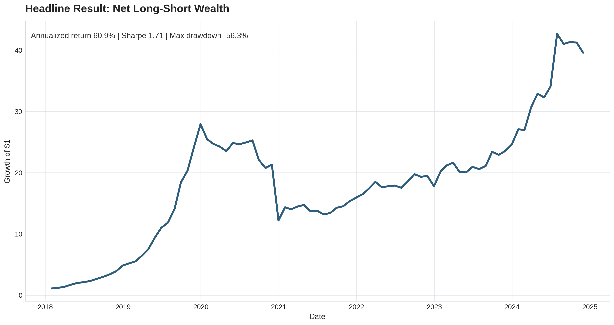
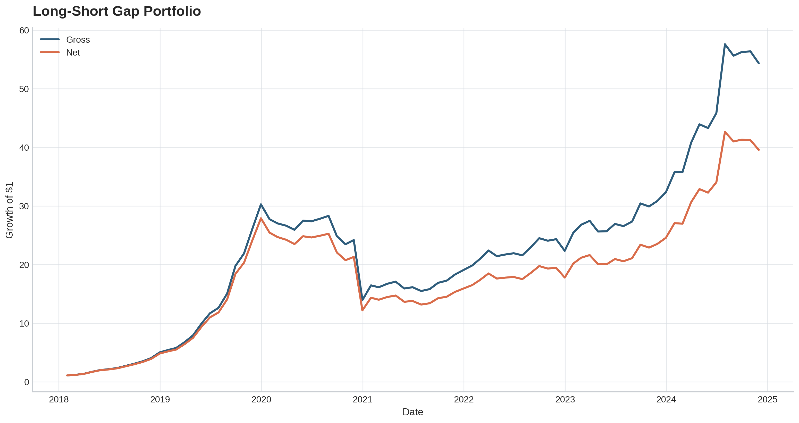
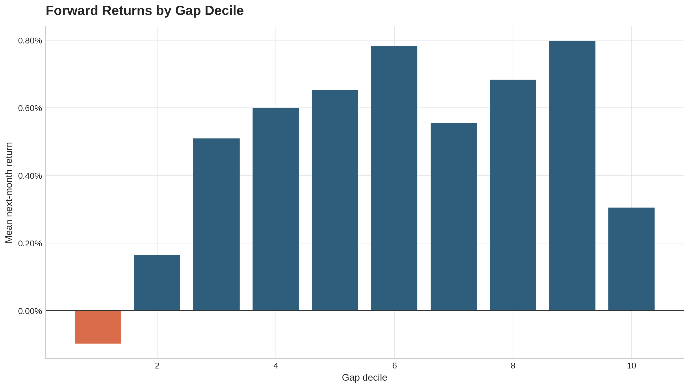
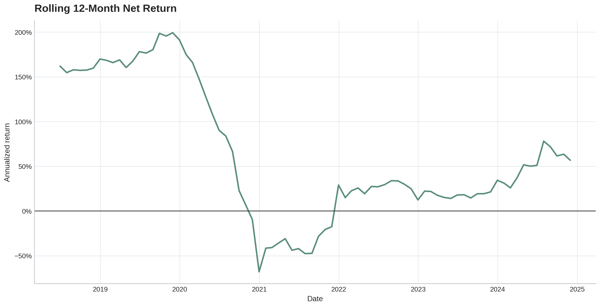
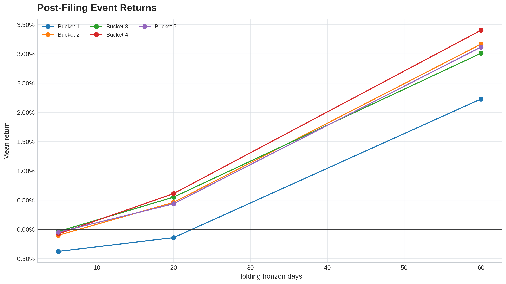
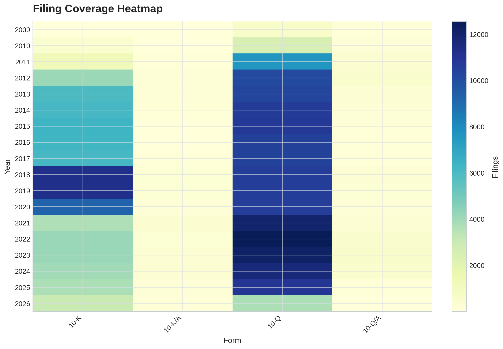
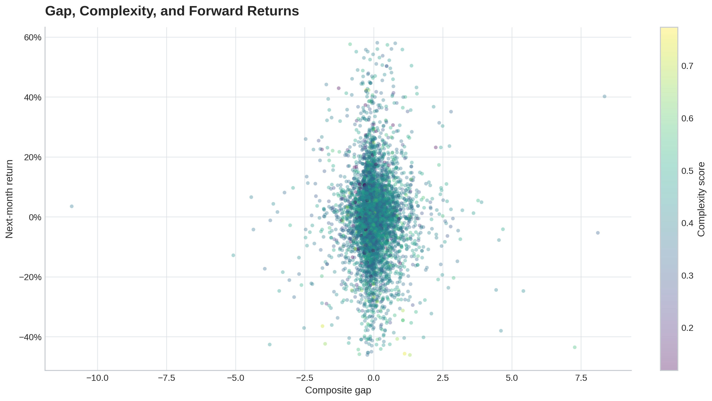
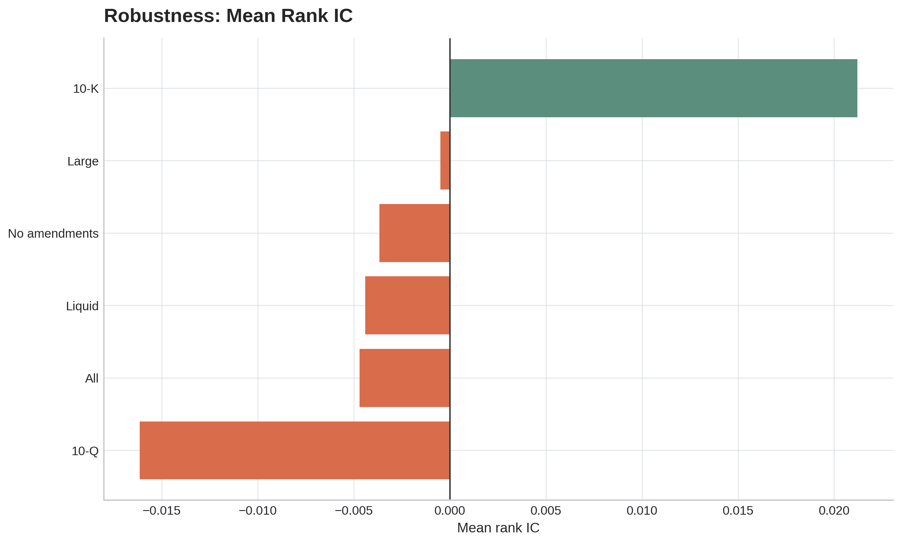
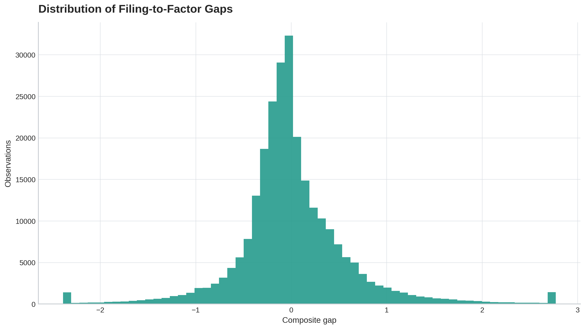
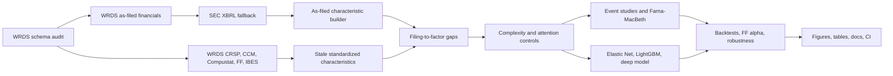

# filing-to-factor gap

Research-grade asset-pricing pipeline for testing whether newly public as-filed fundamentals predict equity returns before the same information is fully absorbed into standard factor inputs.




## Executive summary

This repository implements a full empirical finance stack around a simple idea: public accounting information is not instantly translated into the factor language investors actually trade. The pipeline reconstructs profitability, investment, accrual, balance-sheet, and complexity signals directly from 10-K and 10-Q filings when they become public, compares those signals with stale standardized Compustat characteristics, and tests the resulting filing-to-factor gap in event studies, Fama-MacBeth regressions, machine-learning forecasts, factor attribution, and cost-aware portfolio backtests.

## Research question

Do stocks with large as-filed characteristic shocks earn different subsequent returns after the signals are formed only when the underlying filings are publicly available?

The economic intuition is that a filing can contain economically important information before that information is cleanly reflected in conventional standardized factor datasets. If the translation is difficult because the filing is complex, sparse, amended, or hard to map, the market may incorporate the information gradually rather than immediately.

## Headline answer

Yes, the as-filed gap is a serious research candidate. In the final private run, the LightGBM tabular model achieved the strongest out-of-sample score among the tested forecasting models, and the gap-ranked long-short sleeve retained positive factor-adjusted performance after turnover costs.

| Item | Final run value |
|---|---:|
| Full panel | 247,806 filing observations |
| Linked CRSP firms | 7,057 |
| Sample window | 2009-04-30 to 2026-05-31 |
| OOS prediction rows | 109,662 |
| Best model rank IC | 0.1130 |
| Net annualized return | 60.92% |
| Net Sharpe | 1.71 |
| Net monthly FF alpha | 5.41% |
| Net FF alpha HAC t-stat | 2.75 |

## Visual results

| Portfolio validation | Filing signal diagnostics |
|---|---|
|  |  |
| Net and gross wealth for the monthly gap-ranked sleeve. | Mean next-month returns by gap decile. |
|  |  |
| Rolling annualized net return. | Fixed-horizon post-filing returns by signal bucket. |

| Coverage and robustness | Model diagnostics |
|---|---|
|  |  |
| Filing coverage by year and form type. | As-filed gap, complexity, and forward returns. |
|  |  |
| Rank IC across interpretable sample slices. | Cross-sectional distribution of gap signals. |

## Pipeline architecture



## Public aggregate tables

Key result tables are committed under `artifacts/tables/public/`.

| Table | Role |
|---|---|
| `model_scorecard.csv` | Elastic Net, LightGBM, and deep-model OOS scores |
| `factor_alpha.csv` | Gross and net FF alpha with HAC t-stats |
| `monthly_backtest_summary.csv` | Annualized return, volatility, Sharpe, drawdown |
| `gap_decile_returns.csv` | Forward returns by gap decile |
| `rank_ic.csv` | Month-by-month rank IC |
| `event_study.csv` | 5-, 20-, and 60-day filing-event returns |
| `robustness_summary.csv` | Sample-slice robustness checks |

## Reproducibility

Install and test the public package:

```bash
python -m pip install -e ".[dev,ml,docs]"
python -m ftfg.cli smoke --no-deep
python -m pytest
python -m ruff check src tests
python -m mkdocs build --strict
```

Run the main private pipeline with licensed WRDS access:

```bash
python scripts/001_schema_audit.py
python scripts/002_pull_wrds_core.py
python scripts/003_pull_sec_xbrl.py
python scripts/004_build_real_panel.py
python scripts/005_run_full_outputs.py
python scripts/006_public_release_audit.py
```

On Amarel, the matching SLURM entrypoints live in `jobs/`, including `jobs/resume_after_sec.sh` for resuming after WRDS and SEC caches have already been built.

## Repository map

```text
filing-to-factor-gap/
├── README.md
├── DATA_ACCESS.md
├── configs/
├── scripts/
│   ├── 001_schema_audit.py
│   ├── 002_pull_wrds_core.py
│   ├── 003_pull_sec_xbrl.py
│   ├── 004_build_real_panel.py
│   ├── 005_run_full_outputs.py
│   └── 006_public_release_audit.py
├── src/ftfg/
│   ├── io/
│   ├── features/
│   ├── models/
│   ├── backtest/
│   ├── evaluation/
│   └── viz/
├── artifacts/
│   ├── figures/public/
│   ├── tables/public/
│   └── manifests/
├── docs/
├── jobs/
└── tests/
```

## Skills demonstrated

| Area | What this project demonstrates |
|---|---|
| Empirical finance engineering | WRDS-scale extraction, restartable caches, schema audits, point-in-time joins |
| Accounting data design | As-filed fundamentals, SEC XBRL fallback, Compustat stale comparators |
| Asset pricing | Event studies, Fama-MacBeth regressions, decile sorts, FF alpha |
| Financial ML | Walk-forward OOS validation, Elastic Net, LightGBM, CUDA deep model |
| Backtesting | Monthly long-short construction, event sleeve, turnover costs, robustness slices |
| Release engineering | CI, tests, docs, public aggregate tables, publication-ready figures |

## Data access

The code is public; licensed vendor data are not redistributed. Private replication requires WRDS access to CRSP, Compustat, CCM, as-filed financials, FF factors, and optionally IBES/TAQ-style controls. SEC EDGAR/XBRL endpoints are public and require a descriptive User-Agent. See `DATA_ACCESS.md`.

## License

Code is released under the MIT License. Figures, documentation, and aggregate result tables are intended for public research presentation.
